# Neural Route Ai Agent

**AI Smart Routing Platform — Modern Flutter Interface**

A Final Year Project (FYP) delivering a polished, production-oriented Flutter UI for intelligent multi-model AI routing. The current release is a complete **UI prototype**: authentication, chat modes, history, admin controls, and device pickers are fully interactive on the client, while model responses, routing decisions, and backend services remain intentionally simulated for demonstration and thesis evaluation.

| Item | Detail |
|------|--------|
| **Project name** | Neural Route Ai Agent |
| **Subtitle** | AI Smart Routing Platform |
| **Platform** | Flutter (Dart 3) — Android, iOS, Web, Desktop |
| **Current phase** | UI / UX prototype (no live LLM or auth backend) |
| **Primary users** | Students, researchers, developers evaluating multi-model workflows |

---

## Table of Contents

1. [Project Overview](#1-project-overview)
2. [Motivation](#2-motivation)
3. [Objectives](#3-objectives)
4. [Features](#4-features)
5. [Authentication Flow](#5-authentication-flow)
6. [Dashboard & Navigation](#6-dashboard--navigation)
7. [Sidebar](#7-sidebar)
8. [Smart Routing](#8-smart-routing)
9. [Comparison Mode](#9-comparison-mode)
10. [Offline Mode](#10-offline-mode)
11. [Chat System](#11-chat-system)
12. [History Management](#12-history-management)
13. [Admin Panel](#13-admin-panel)
14. [Responsive Design](#14-responsive-design)
15. [Theme System](#15-theme-system)
16. [Architecture](#16-architecture)
17. [Folder Structure](#17-folder-structure)
18. [Current Dummy Implementation](#18-current-dummy-implementation)
19. [Future Development](#19-future-development)
20. [Future AI Agent Workflow](#20-future-ai-agent-workflow)
21. [Flow Diagrams](#21-flow-diagrams)
22. [Sequence Diagrams](#22-sequence-diagrams)
23. [Component & Architecture Diagrams](#23-component--architecture-diagrams)
24. [State Management](#24-state-management)
25. [Tech Stack](#25-tech-stack)
26. [Real vs Dummy Features](#26-real-vs-dummy-features)
27. [API Integration Plan](#27-api-integration-plan)
28. [Getting Started](#28-getting-started)
29. [Thesis Notes](#29-thesis-notes)
30. [Client Notes](#30-client-notes)
31. [License & Contributors](#31-license--contributors)

---

## 1. Project Overview

**Neural Route Ai Agent** is a Flutter-based client for an AI routing platform. Instead of forcing a user to pick a single large language model for every task, the product concept is to **inspect the prompt**, classify intent, and **route** the request to the most suitable provider (OpenAI, Anthropic, Google Gemini, DeepSeek, local Ollama models, and others).

This repository contains the **front-end prototype** built for a university Final Year Project. It demonstrates:

- End-to-end navigation and screen composition
- Three operational modes: Smart Routing, Comparison, Offline
- Per-mode conversation history with rename, delete, and session restore
- An Admin Panel that mutates a shared in-memory model catalog
- Auth screens (login, signup, OTP, password reset) with client-side validation
- Real device camera / gallery / file pickers for attachments
- Dark and light themes with a consistent design system

**Problem addressed.** Knowledge workers and students often juggle ChatGPT, Claude, Gemini, and local tools. Switching tabs, rewriting the same prompt, and comparing answers manually is slow and error-prone. NeuroRoute’s intended product surface unifies that workflow behind one interface.

**Intended audience.** University evaluators, FYP supervisors, potential collaborators, and stakeholders who need to see the full UX before backend and model APIs are connected.

**Future vision.** A production system where a routing agent scores prompts, selects models with confidence, streams responses, persists history in a database, and supports both cloud APIs and local Ollama inference—while this Flutter client remains the primary user interface.

---

## 2. Motivation

Modern AI usage is fragmented:

| Pain point | Typical user behaviour |
|------------|------------------------|
| Model choice is task-dependent | Coding → one model; creative writing → another; math → another |
| Manual switching | Copy-paste prompts across browser tabs |
| Comparison is informal | Side-by-side answers require screenshots or multiple windows |
| Offline / privacy needs | Cloud-only tools cannot run on air-gapped or low-connectivity devices |
| Admin / ops control | Teams lack a single place to enable or disable providers |

NeuroRoute is motivated by the idea that **routing should be a first-class product feature**, not a user burden. Smart Routing mode represents the long-term core: analyse the prompt, pick a model from an active catalog, return a single best answer. Comparison mode supports evaluation and research. Offline mode anticipates local inference via Ollama.

The FYP phase focuses on **interface completeness and architectural readiness**, so that subsequent backend work can plug into well-defined UI boundaries rather than reshaping the product later.

---

## 3. Objectives

1. **Deliver a complete, coherent Flutter UI** covering auth, three chat modes, history, and administration.
2. **Establish clear module boundaries** (screens, reusable widgets, shared stores) suitable for thesis documentation and multi-member development.
3. **Simulate end-to-end flows** (login → chat → history → admin) without requiring live API keys during demos.
4. **Support responsive layouts** so the same codebase demonstrates desktop shell and mobile drawer patterns.
5. **Expose a shared model catalog** that Admin can mutate and that Smart Routing / Comparison consume immediately.
6. **Document real vs simulated behaviour** so evaluators and clients understand the current scope and the roadmap.
7. **Prepare integration points** (`_send`, `_login`, `_connect`, store APIs) where REST or WebSocket backends will attach later.

---

## 4. Features

### 4.1 Authentication (UI)

| Aspect | Detail |
|--------|--------|
| **Purpose** | Gate the app and demonstrate account lifecycle UX |
| **How it works** | Forms with validators; success navigates with a short artificial delay |
| **Current** | Login, Signup, Forgot Password, OTP (6 digits), Reset Password; Google/GitHub buttons are non-functional placeholders |
| **Future** | Real JWT/session auth, email OTP, OAuth providers |

### 4.2 Smart Routing

| Aspect | Detail |
|--------|--------|
| **Purpose** | Single-response mode: one prompt → one routed model answer |
| **How it works** | After send, UI shows a “thinking” indicator; a random **active** model and a random category label are chosen; a placeholder response is appended |
| **Current** | Dummy routing over `modelStore.active`; in-memory session history |
| **Future** | Intent classification, confidence scoring, real provider APIs |

### 4.3 Comparison Mode

| Aspect | Detail |
|--------|--------|
| **Purpose** | Parallel answers from multiple selected models |
| **How it works** | End drawer multi-select; one user message followed by one dummy response per selected model; wide layout uses a two-column wrap |
| **Current** | Static placeholder text; selection persisted only in screen state |
| **Future** | Concurrent API calls, streaming, side-by-side metrics |

### 4.4 Offline Mode

| Aspect | Detail |
|--------|--------|
| **Purpose** | Chat against local models without cloud dependency |
| **How it works** | “Connect to Ollama” toggles a local connected flag after a delay; dummy local model names (`llama3:8b`, etc.) appear; chat uses placeholder text |
| **Current** | Fully simulated connection and responses |
| **Future** | Real Ollama HTTP API, model pull/list, offline inference |

### 4.5 History & Chat Tools

| Aspect | Detail |
|--------|--------|
| **Purpose** | Continuity across sessions within a mode |
| **How it works** | `HistoryStore` holds `ChatSession` lists; sidebar filters by `ChatMode`; inline rename; inline delete confirm; edit prompt regenerates dummy replies |
| **Current** | In-memory only; lost on restart |
| **Future** | Database or cloud sync |

### 4.6 Admin Panel

| Aspect | Detail |
|--------|--------|
| **Purpose** | Manage the LLM catalog used by routing and comparison |
| **How it works** | Add / edit name & provider / toggle active / delete; `ModelStore` notifies listeners |
| **Current** | Client-side shared state only |
| **Future** | CRUD via admin API, credentials, rate limits |

### 4.7 Attachments

| Aspect | Detail |
|--------|--------|
| **Purpose** | Attach context files to a prompt |
| **How it works** | `image_picker` (camera & gallery) and `file_picker` (project files); chips show file names only—nothing is uploaded |
| **Current** | Real device pickers; names stored on the user `ChatMessage` |
| **Future** | Upload to storage, multimodal API payloads |

### 4.8 Theme & Shell

| Aspect | Detail |
|--------|--------|
| **Purpose** | Comfortable long sessions; desktop vs mobile shell |
| **How it works** | `AppTheme.dark()` / `light()`; `HomeShell` permanent sidebar ≥ 820px width, drawer below |
| **Current** | Full visual system in place |
| **Future** | Optional system theme follow, custom brand themes |

---

## 5. Authentication Flow

### Screens

1. **Login** — email + password validation; navigates to `HomeShell` on success (simulated).
2. **Signup** — name, email, password, confirm, terms checkbox; navigates to OTP.
3. **Forgot Password** — email only; navigates to OTP with `OtpPurpose.passwordReset`.
4. **OTP** — six digit boxes with focus advance; timer for resend; purpose-dependent next step.
5. **Reset Password** — new + confirm password; returns to Login with a snackbar.

Social buttons (Google, GitHub) are present for layout completeness only.

### Current status

- Client validation only (`AuthValidators`)
- Artificial `Future.delayed` (~700 ms) instead of network calls
- No tokens, no secure storage, no backend

### Future API integration

- `POST /auth/login`, `POST /auth/register`, `POST /auth/otp/verify`, `POST /auth/password/reset`
- Secure storage of access/refresh tokens
- Session restore on cold start

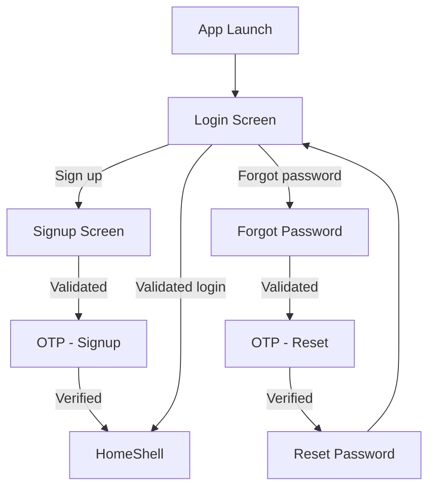

---

## 6. Dashboard & Navigation

After login, **`HomeShell`** is the root of the authenticated experience.

- **Desktop / tablet (width ≥ 820):** permanent left `Sidebar` + content pane.
- **Mobile (width < 820):** `Drawer` opened via hamburger in `ScreenHeader`.

Mode selection is index-based (`0` Smart Routing, `1` Comparison, `2` Offline). Admin is a separate flag (`_adminSelected`) so history is hidden while managing models.

GlobalKeys on each chat screen state allow the shell to call `startNewChat()` and `openSession(ChatSession)` when the sidebar acts.

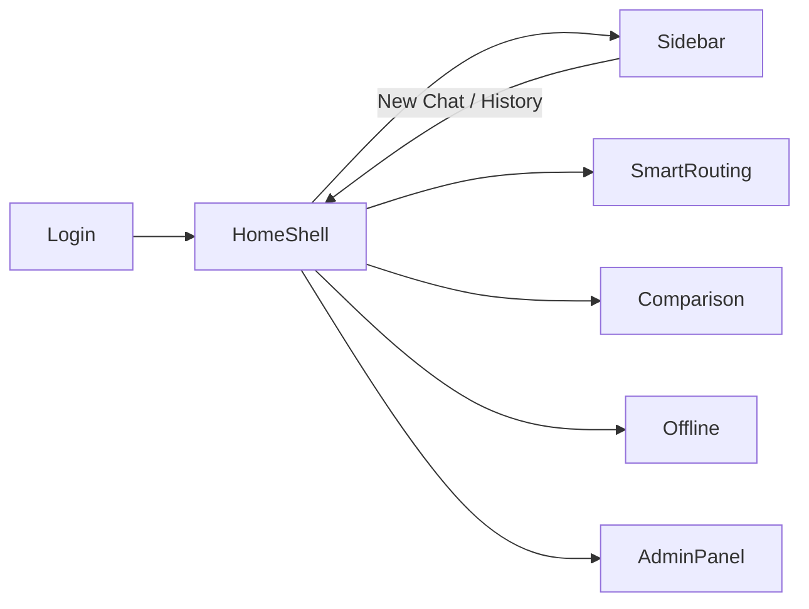

---

## 7. Sidebar

The sidebar is the primary navigation and history surface.

| Control | Behaviour |
|---------|-----------|
| **Brand** | NeuroRoute logo + title |
| **New Chat** | Clears the active mode’s current session via shell → screen `startNewChat()` |
| **Smart Routing / Comparison / Offline Mode** | Switches `_index`, clears admin selection |
| **History list** | Sessions for the **current mode only**; tap opens session; selected row highlighted |
| **Inline rename** | Title becomes a focused `TextField`; Enter / outside tap saves; Escape cancels |
| **Delete** | Inline confirm row (not a full-screen dialog); swipe also requests confirm |
| **Light / Dark Mode** | Calls app-level `onToggleTheme` |
| **Admin Panel** | Sets `_adminSelected = true` |
| **Account row** | Static placeholder user; logout returns to Login |

History items stay compact (ChatGPT-like density) so several recent chats remain visible without scrolling past large tiles.

---

## 8. Smart Routing

### Purpose

Present a single best answer by routing the user prompt to an appropriate model.

### Current flow

1. User types (or picks a suggestion chip) and sends.
2. A `ChatSession` is created or updated; user message stored.
3. UI shows “Analyzing prompt & selecting best model…”.
4. After ~900 ms, a model is chosen **uniformly at random** from `modelStore.active` (or all models if none active). A category string is also chosen at random for display text only.
5. A placeholder assistant message is appended; history is touched.

### Future routing engine (planned)

- Prompt analysis and intent detection (coding, math, creative, multimodal, etc.)
- Tag / capability matching against model metadata
- Latency, cost, and quality policies
- Confidence score and optional fallback models
- Streaming tokens from the selected provider API

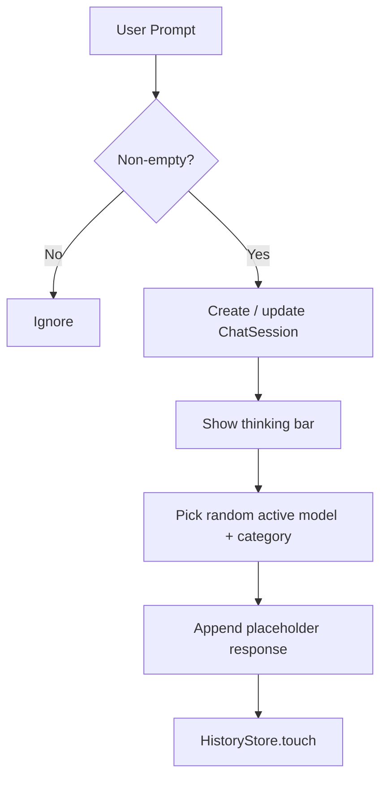

---

## 9. Comparison Mode

### Purpose

Evaluate the same prompt across multiple models side by side.

### Current flow

1. User opens the end drawer and selects models (checkbox list from `modelStore`).
2. Selected models appear as chips under the header.
3. On send, one user message is stored, then one dummy response **per selected model**.
4. On wide layouts, response cards wrap in two columns; on narrow layouts, they stack.
5. Edit of a user message removes the previous response group and regenerates for the **current** selection.

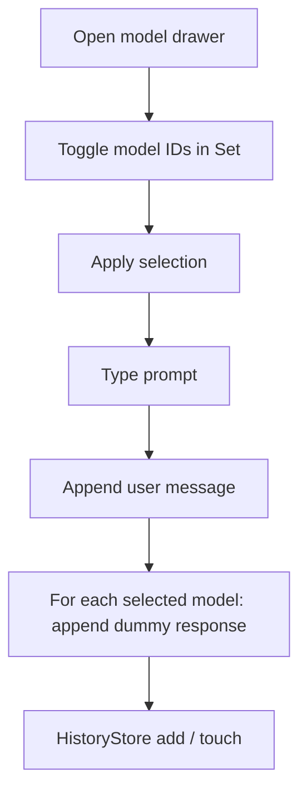

**Future:** parallel HTTP calls, staggered streaming, export of comparison tables, A/B metrics.

---

## 10. Offline Mode

### Purpose

Support local inference for privacy and low-connectivity scenarios.

### Current UI

- Setup card with high-level Ollama install steps (informational text only)
- **Connect to Ollama** → loading state → connected panel listing dummy model names
- Chat input works whether or not the user has “connected”; responses remain placeholders attributed to a random local model name

### Future architecture (planned)

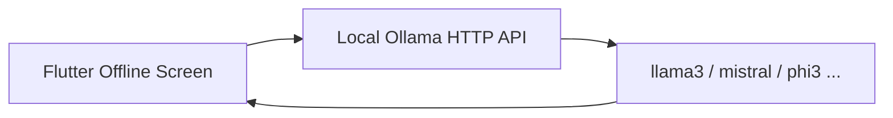

Planned work: list models from `http://localhost:11434`, stream generate, respect selected local model, surface connection errors.

---

## 11. Chat System

Shared behaviours across Smart Routing, Comparison, and Offline:

| Action | Implementation |
|--------|----------------|
| **Create chat** | First message creates `ChatSession` and `historyStore.addSession` |
| **Continue chat** | Further messages append; `historyStore.touch` moves session to top |
| **Open from history** | Shell switches mode if needed and calls `openSession` |
| **New Chat** | Screen clears local `_session`; shell clears active id |
| **Edit prompt** | Inline `MessageEditBox`; on confirm, text updated, following assistant messages removed, dummy regeneration |
| **Regenerate** | Replaces that assistant message with a new placeholder |
| **Copy** | Clipboard + floating “Copied” toast |
| **Attachments** | Names attached to the user message; chips in the bubble when present |

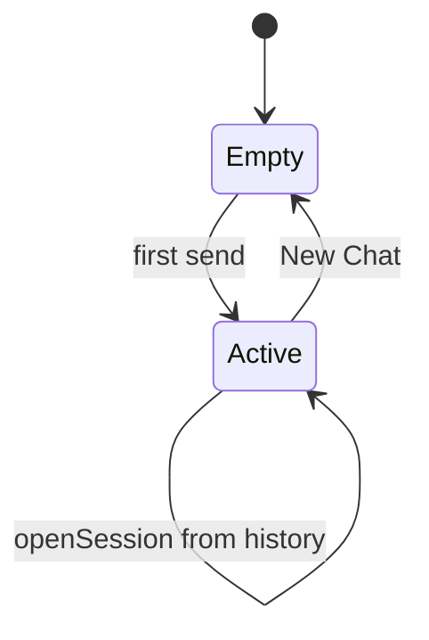

---

## 12. History Management

### Current implementation

- Global `historyStore` (`ChangeNotifier`)
- Each `ChatSession`: `id`, `title`, `mode`, `messages`, `updatedAt`
- `forMode(ChatMode)` filters and sorts by `updatedAt`
- Rename and delete mutate the store and notify the sidebar `ListenableBuilder`

### Session lifecycle

1. Created on first message in a mode screen  
2. Updated on every send, edit, or regenerate  
3. Selected in sidebar → restored into the matching screen state  
4. Deleted → removed from store; active highlight cleared if needed  

### Storage

**In-memory only.** Application restart clears all sessions. This is intentional for the UI prototype.

### Future

- Local SQLite / Hive, or remote conversation API
- Pagination and search
- Cross-device sync under authenticated user

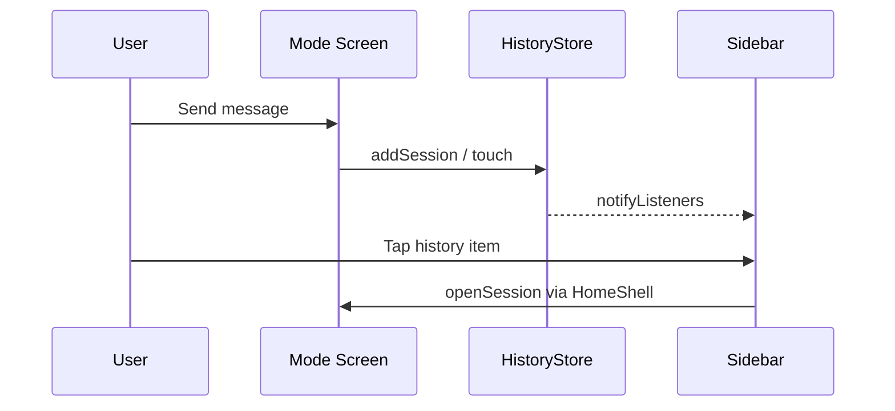

---

## 13. Admin Panel

### Capabilities

- Stats: total models, active count, distinct providers  
- **Add Model** — appends a dummy custom model  
- **Toggle** — `modelStore.toggleActive`  
- **Edit** — dialog for name and provider; `modelStore.refresh()`  
- **Delete** — `modelStore.remove`  

### Shared state

`modelStore` is a process-wide singleton. Smart Routing’s active badge and Comparison’s drawer update immediately through `ListenableBuilder`.

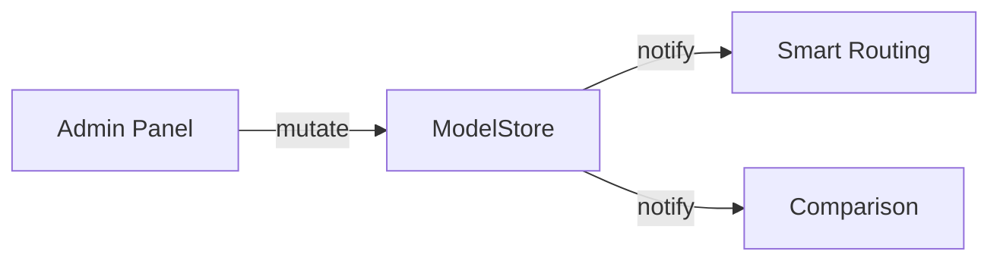

**Future:** server-side model registry, API keys per provider, health checks, usage quotas.

---

## 14. Responsive Design

| Breakpoint | Behaviour |
|------------|-----------|
| **≥ 820 px** | Permanent sidebar (260 px) + vertical divider + content |
| **< 820 px** | Full-width content; sidebar in `Drawer`; menu icon in header |

Chat lists, comparison cards, and admin stat rows also adapt (e.g. comparison two-column wrap above ~640 px content width; admin stats stack on narrow widths).

---

## 15. Theme System

Defined in `lib/app_theme.dart`:

- **AppColors** — purple brand, dark/light surfaces, borders, text, provider accent colours  
- **AppTheme.dark() / light()** — Material 3 `ThemeData` copyWith  
- **AppColorsX** on `BuildContext` — `isDark`, `surface`, `surface2`, `borderColor`, `textPrimary`, `textSecondary`, `bg`  

Theme mode is owned by `NeuroRouteApp` and passed into `LoginScreen` / `HomeShell`. Toggle lives in the sidebar.

Typography relies on the platform Material text theme with consistent weight and size choices in widgets (compact sidebar ~13 px, headers ~16–17 px, primary buttons ~14–15 px).

---

## 16. Architecture

### Layers

1. **Entry** — `main.dart` → `NeuroRouteApp` → `LoginScreen`  
2. **Shell** — `HomeShell` owns navigation index, admin flag, session id map, GlobalKeys  
3. **Screens** — Auth suite; Smart Routing; Comparison; Offline; Admin  
4. **Widgets** — Sidebar, ChatInputBar, ScreenHeader, message actions, copy toast, auth building blocks  
5. **Domain models & stores** — `LlmModel`, `ChatMessage`, `ChatSession`, `ModelStore`, `HistoryStore`  

### State approach

No external state package. Shared mutable stores extend `ChangeNotifier`; UI rebuilds via `ListenableBuilder`. Screen-local state (`TextEditingController`, editing indices, selected model sets) remains in `StatefulWidget`s.

### Dependencies (runtime)

- `flutter` / Material  
- `image_picker` — camera & gallery  
- `file_picker` — arbitrary files  
- `cupertino_icons`  

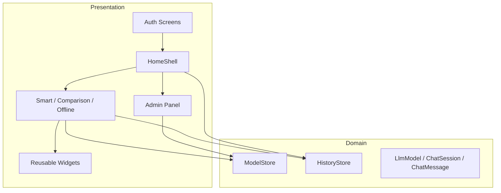

---

## 17. Folder Structure

```text
neuroroute_ui/
├── README.md
├── pubspec.yaml
├── assets/
│   ├── fonts/          # Optional custom fonts (README placeholder)
│   └── images/         # Optional images (declared in pubspec)
└── lib/
    ├── main.dart                 # App entry, theme mode owner
    ├── app_theme.dart            # Colours, ThemeData, context helpers
    ├── models.dart               # LlmModel, Chat*, stores, ChatMode
    ├── screens/
    │   ├── admin_panel_screen.dart
    │   ├── comparison_screen.dart
    │   ├── offline_mode_screen.dart
    │   ├── smart_routing_screen.dart
    │   └── auth/
    │       ├── auth_widgets.dart
    │       ├── login_screen.dart
    │       ├── signup_screen.dart
    │       ├── forgot_password_screen.dart
    │       ├── otp_screen.dart
    │       └── reset_password_screen.dart
    └── widgets/
        ├── home_shell.dart
        ├── sidebar.dart
        ├── chat_input_bar.dart
        ├── screen_header.dart
        ├── message_actions.dart
        └── copy_toast.dart
```

Platform folders (`android/`, `ios/`, `web/`) are **not** shipped in the design-only zip; create them with `flutter create .` as described in [Getting Started](#28-getting-started).

---

## 18. Current Dummy Implementation

This project is a **UI prototype**. The following are deliberate simulations:

| Area | Simulation |
|------|------------|
| Login / Signup / OTP / Reset | Validation + delay; always succeeds if form is valid |
| Google / GitHub | Buttons only |
| Smart Routing selection | Random active model + random category string |
| Comparison answers | Static placeholder per model name |
| Offline connect | Local boolean after delay; dummy model list |
| Chat replies | Fixed template text mentioning the model name |
| History | RAM only |
| Admin model list | Seed list + client mutations |
| Attachments | Real pickers; no upload |

Placeholder responses make demos and screenshots possible without API keys. Integration work should replace the delayed blocks inside `_login`, `_send`, `_connect`, `_verify`, etc., without redesigning the surrounding `setState` / store flow.

---

## 19. Future Development

| Area | Planned direction |
|------|-------------------|
| **Auth** | REST auth, OTP email, OAuth, refresh tokens |
| **Persistence** | Conversation and message tables; optional sync |
| **Smart Routing** | Classifier / agent service; policy engine; confidence |
| **Providers** | OpenAI, Anthropic, Gemini, DeepSeek, Grok, custom |
| **Offline** | Ollama generate/chat API; model management |
| **RAG** | Optional vector store + retrieval before generation |
| **Ops** | Logging, metrics, rate limiting, admin audit trail |
| **Deploy** | Web hosting, mobile store builds, CI |

---

## 20. Future AI Agent Workflow

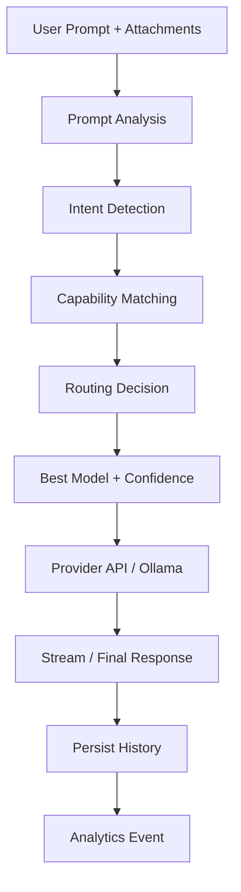

The Flutter client already separates **presentation** (messages, thinking bar, history) from **decision** (today a random pick). Replacing the decision step with a remote agent keeps UI stability.

---

## 21. Flow Diagrams

### Navigation (authenticated)

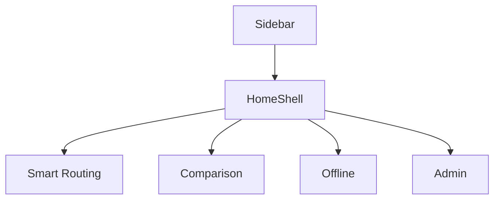

### Attachment flow

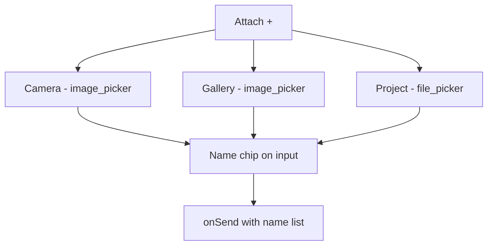

### Theme switching

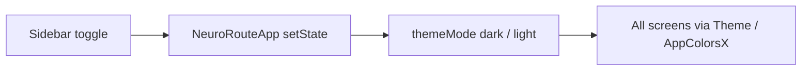

### Overall system (current)

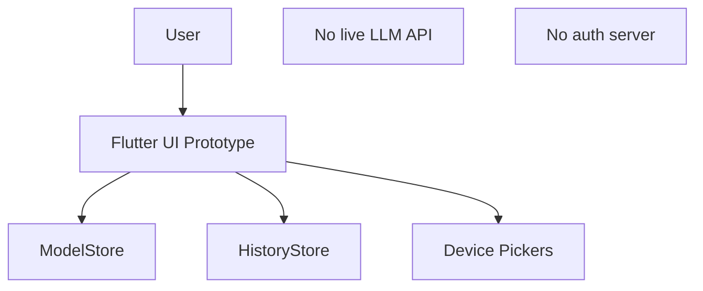

---

## 22. Sequence Diagrams

### User login (current)

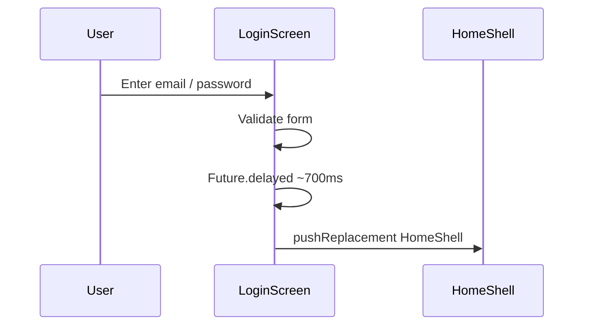

### Prompt submission (Smart Routing, current)

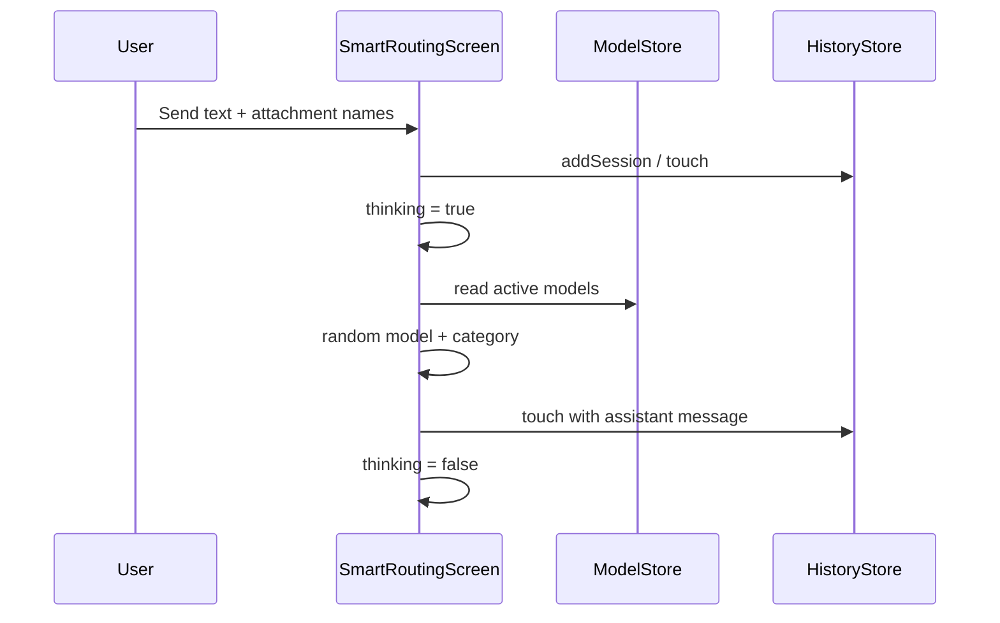

### History save & open

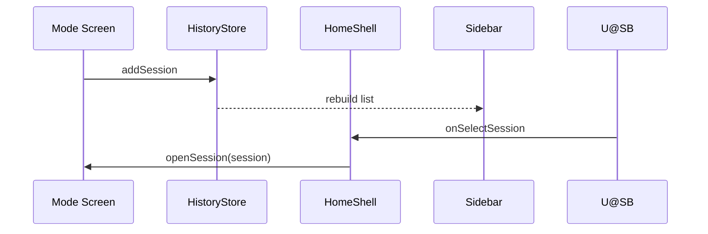

---

## 23. Component & Architecture Diagrams

### Component diagram

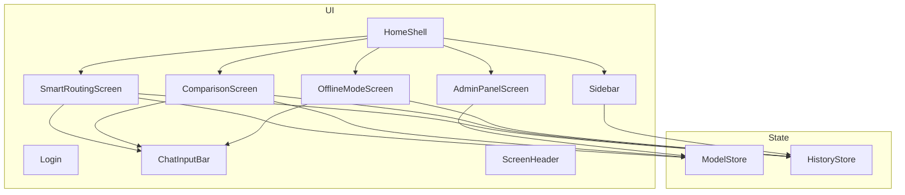

### Target architecture (future)

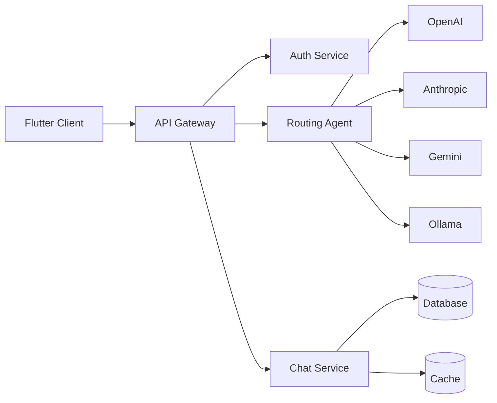

---

## 24. State Management

| Concern | Mechanism |
|---------|-----------|
| Theme mode | `NeuroRouteApp` `StatefulWidget` |
| Navigation index / admin flag / active session ids | `HomeShell` state |
| Model catalog | `ModelStore` (`ChangeNotifier`) singleton |
| Chat sessions | `HistoryStore` (`ChangeNotifier`) singleton |
| Per-screen draft, editing index, selection sets | Local `State` |

Rebuilds for stores use `ListenableBuilder`. No Provider, Riverpod, or Bloc dependency is required in the current phase.

---

## 25. Tech Stack

| Layer | Choice |
|-------|--------|
| Framework | Flutter (Material 3) |
| Language | Dart SDK `>=3.0.0 <4.0.0` |
| State | `ChangeNotifier` + `ListenableBuilder` |
| Navigation | Imperative `Navigator` + shell composition |
| Packages | `image_picker`, `file_picker`, `cupertino_icons` |
| Lint | `flutter_lints` |
| Assets | `assets/images/`, optional `assets/fonts/` |
| Icons | Material Icons (`Icons.*_rounded` / outlined) |

---

## 26. Real vs Dummy Features

| Feature | Current status | Future status | Needs API |
|---------|----------------|---------------|-----------|
| Login / Signup / OTP UI | Real UI + validation | Full auth | Yes |
| Social login buttons | Dummy | OAuth | Yes |
| Smart Routing UI | Real | Same | — |
| Routing decision | Dummy (random) | Agent / rules | Yes |
| Comparison UI | Real | Same | — |
| Comparison answers | Dummy text | Live multi-call | Yes |
| Offline connect | Dummy flag | Ollama client | Local HTTP |
| Offline answers | Dummy text | Local inference | Local HTTP |
| History UI | Real | Same | — |
| History storage | In-memory | DB / cloud | Optional |
| Admin CRUD UI | Real (client) | Server-backed | Yes |
| Model catalog seed | Hard-coded | Config / API | Yes |
| Camera / gallery / files | **Real pickers** | + upload | Storage |
| Theme toggle | Real | Same | — |
| Responsive shell | Real | Same | — |
| Edit / copy / regenerate | Real (client) | + server regen | Optional |

---

## 27. API Integration Plan

Integration should **not** invent endpoints in the UI layer prematurely. Recommended touch points already exist as delayed futures:

| UI entry | Planned replacement |
|----------|---------------------|
| `LoginScreen._login` | Auth token endpoint |
| `SignupScreen._signup` + OTP verify | Register + verify |
| `ForgotPassword` / `ResetPassword` | Password reset pipeline |
| `SmartRoutingScreen._appendAiResponse` | Router service then provider completion |
| `ComparisonScreen._send` | Fan-out completions |
| `OfflineModeScreen._connect` / `_appendAiResponse` | Ollama `/api/tags` and `/api/chat` |
| `AdminPanelScreen` mutations | Admin model registry API |
| `HistoryStore` | Persistence service or repository |

Suggested client structure later: `services/` (auth, chat, models), `repositories/`, DTOs, and error mapping—keeping widgets free of raw HTTP.

---

## 28. Getting Started

This package ships `lib/`, `pubspec.yaml`, and `assets/` only.

```bash
# Empty directory
flutter create .
# Copy lib/, pubspec.yaml, assets/ from this project over the scaffold
flutter pub get
flutter run                 # or: flutter run -d chrome
```

### Permissions (after platform folders exist)

**Android** — `android/app/src/main/AndroidManifest.xml` inside `<manifest>`:

```xml
<uses-permission android:name="android.permission.CAMERA"/>
<uses-permission android:name="android.permission.READ_MEDIA_IMAGES"/>
<uses-permission android:name="android.permission.READ_EXTERNAL_STORAGE"/>
```

**iOS** — `ios/Runner/Info.plist`:

```xml
<key>NSCameraUsageDescription</key>
<string>NeuroRoute needs camera access to attach photos to a prompt.</string>
<key>NSPhotoLibraryUsageDescription</key>
<string>NeuroRoute needs photo library access to attach screenshots/images.</string>
```

On web, camera may open a file chooser; native mobile builds exercise the real camera path.

### Custom fonts / images

Place files under `assets/fonts/` or `assets/images/` and follow comments in `pubspec.yaml` and `app_theme.dart`.

---

## 29. Thesis Notes

Suggested mapping of chapters to modules:

| Thesis chapter focus | Primary code / docs |
|----------------------|---------------------|
| Introduction & motivation | §§1–3 of this README |
| Requirements & objectives | §3, §4 |
| System design | §§16–17, §23 |
| Authentication module | §5, auth screens |
| Smart Routing module | §8, §20 |
| Comparison module | §9 |
| Offline / edge inference | §10 |
| History & state | §§12, 24 |
| Admin & model governance | §13 |
| UI/UX & responsive design | §§14–15 |
| Implementation status | §§18, 26 |
| Future work | §§19–20, 27 |
| Conclusion | Derived from objectives vs status |

Sequence and architecture diagrams in §§21–23 are suitable for inclusion with light reformatting. Always state clearly when behaviour is simulated versus implemented.

---

## 30. Client Notes

NeuroRoute’s current application is a **polished UI prototype**. Dummy data, placeholder model replies, simulated login, and in-memory history exist so stakeholders can walk the full product path without provisioning AI API keys or a backend.

What is real today:

- Navigation and responsive shell  
- Form validation and screen flows  
- Shared model list with live UI updates from Admin  
- Per-mode history operations (including inline rename and confirm-delete)  
- Device camera, gallery, and file selection  

What will come in later phases:

- Production authentication  
- Live routing and multi-provider completions  
- Ollama-backed offline inference  
- Durable conversation storage  

The Flutter structure is intentionally shaped so those capabilities can attach at the existing service call sites without redesigning the user experience.

---

## 31. License & Contributors

**Project:** NeuroRoute — Final Year Project  
**Type:** Academic / demonstration UI  

List team members, supervisor, and institution here as appropriate for your submission.

```text
Copyright (c) 2026 NeuroRoute FYP Team
All rights reserved for academic submission unless otherwise agreed.
```

---

*Document version aligned with the design-only Flutter prototype (`neuroroute_ui`). Update this README when backend integration changes the real/dummy boundary.*
